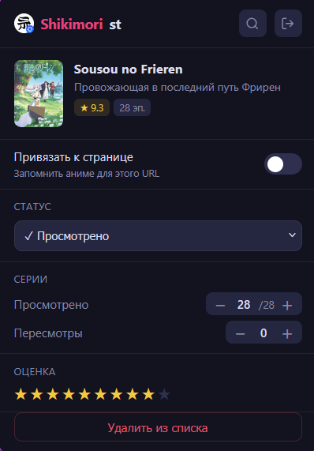
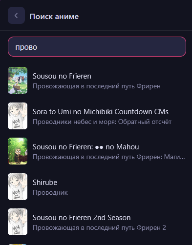
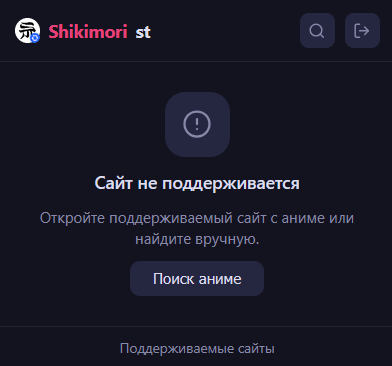

# Shikimorist V2
[](https://claude.ai/)
---

Форк расширения [Shikimorist](https://github.com/Hokid/shikimorist) с поддержкой Firefox, исправленными ошибками и обновлённым дизайном. 

#### Для установки на Firefox: 
Скачайте файл расширения (``.xpi``) на странице релизов, зайдите на страницу дополнений (``about:addons``) и выберите «Установить дополнение из файла». Расширение уже подписано через магазин дополнений.

#### Chrome и ему подобные:
Вероятно, будет работать, но работоспособность не проверялась.

#### Описание:
Быстрый доступ к списку аниме на [shikimori](https://shikimori.one). Отмечайте серии, ставьте оценки, добавляйте аниме, не выходя со страницы онлайн-просмотра.

<p align="center">
  
  
  
</p>

##### Как пользоваться:
Авторизуйтесь на Shikimori через расширение после установки. Перейдите на страницу аниме на сайте онлайн-просмотра (список поддерживаемых можно найти ниже) и откройте расширение — оно автоматически найдёт аниме в вашем списке, покажет статус, прогресс и оценку или предложит добавить его.

##### Возможности:
 - Добавление аниме в список
 - Обновление статуса просмотра
 - Удаление аниме из списка
 - Обновление оценки
 - Обновление счётчика серий/пересмотров

##### Расширение поддерживает следующие сайты:
- [https://animego.org](https://animego.org)
- [https://animego.me](https://animego.me)
- [https://yummyanime.tv](https://yummyanime.tv)
- [https://yummyanime.org](https://yummyanime.org)
- [https://animestars.org](https://animestars.org)
- [https://animebesst.org](https://animebesst.org)
- [https://online.animedia.tv](https://online.animedia.tv)
- [https://animevost.org](https://animevost.org)
- [https://anilibria.life](https://anilibria.life)
- [https://anilibria.tv](https://anilibria.tv)
- [https://akari-anime.com](https://akari-anime.com)
- [https://anidub.life](https://anidub.life)
- [https://wikianime.tv](https://wikianime.tv)
- [https://rezka.ag](https://rezka.ag)
- [https://www.kinopoisk.ru](https://www.kinopoisk.ru)
- [https://hd.kinopoisk.ru](https://hd.kinopoisk.ru)

### Как добавить поддержку ресурса(парсер)
Все парсеры хранятся в файле ``content_script.js``, для добавления нужно знать html элемент с названием тайтла, и его формат. Вот парсер на примере Анилибрии:
```js
{
  id: 'anilibria',
  test: (h) => h.endsWith('anilibria.tv'),
  path: /^\/release\//,
  parse(doc) {
    const m = doc.querySelector('meta[property="og:title"]');
    if (!m) return null;
    const p = (m.getAttribute('content') || '').split('/');
    return p[1] ? p[1].trim() : null;
  }
},
```